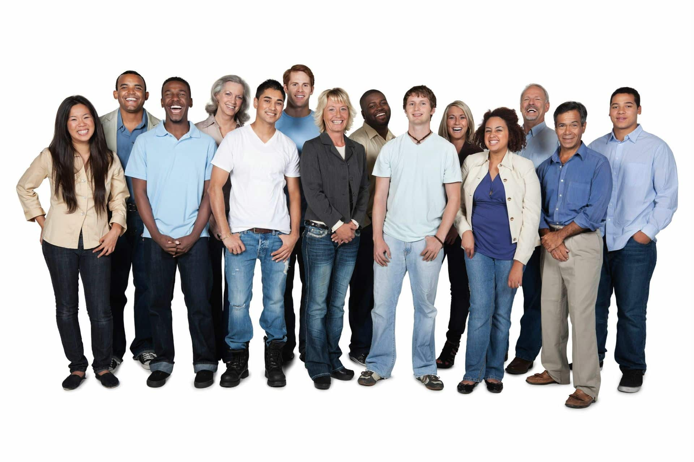
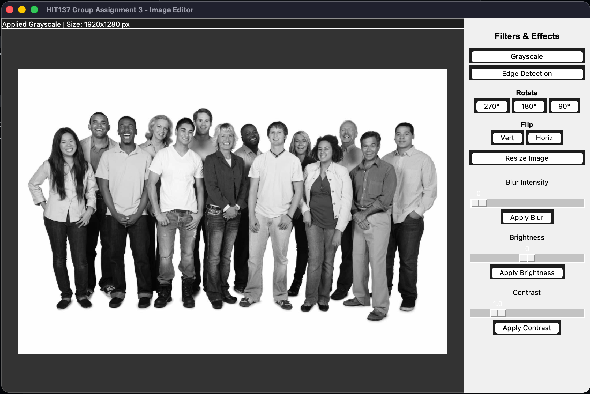
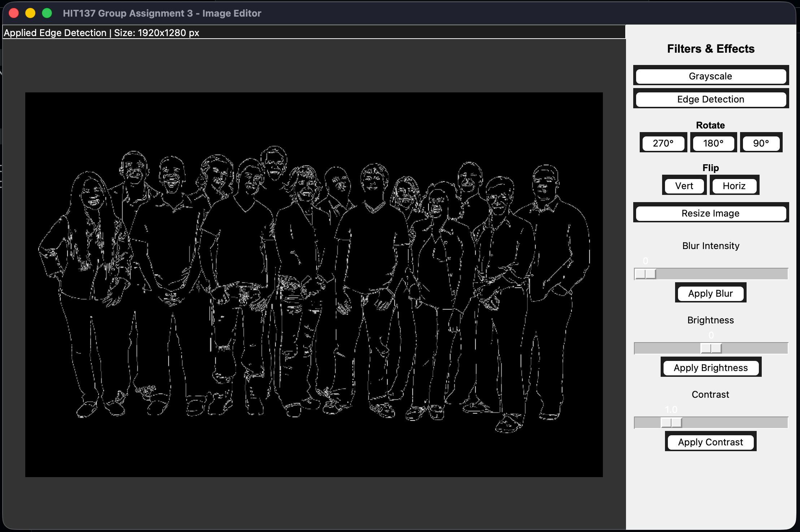
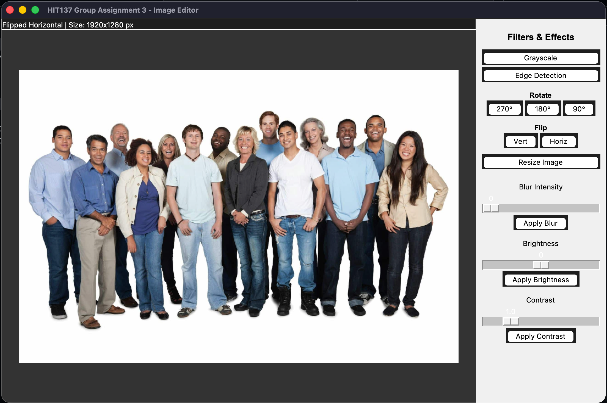
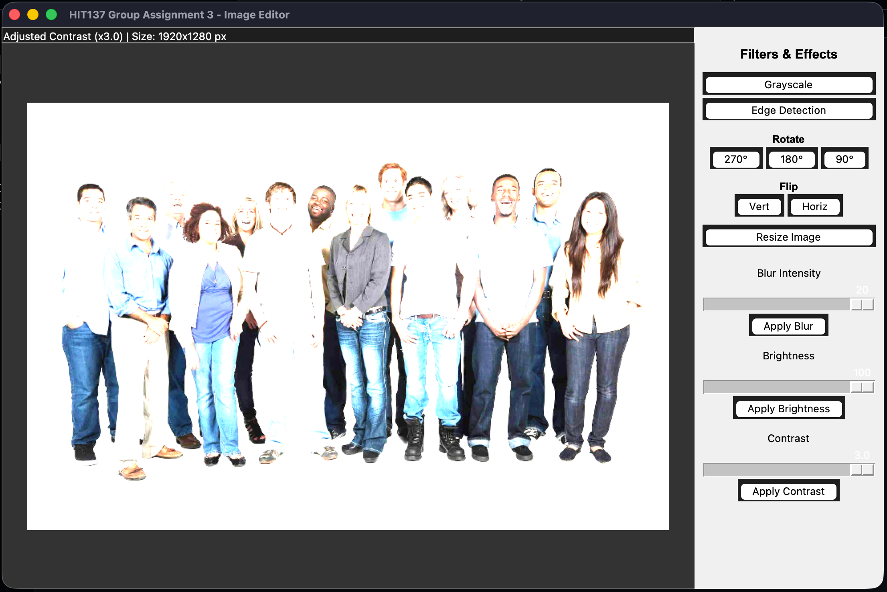
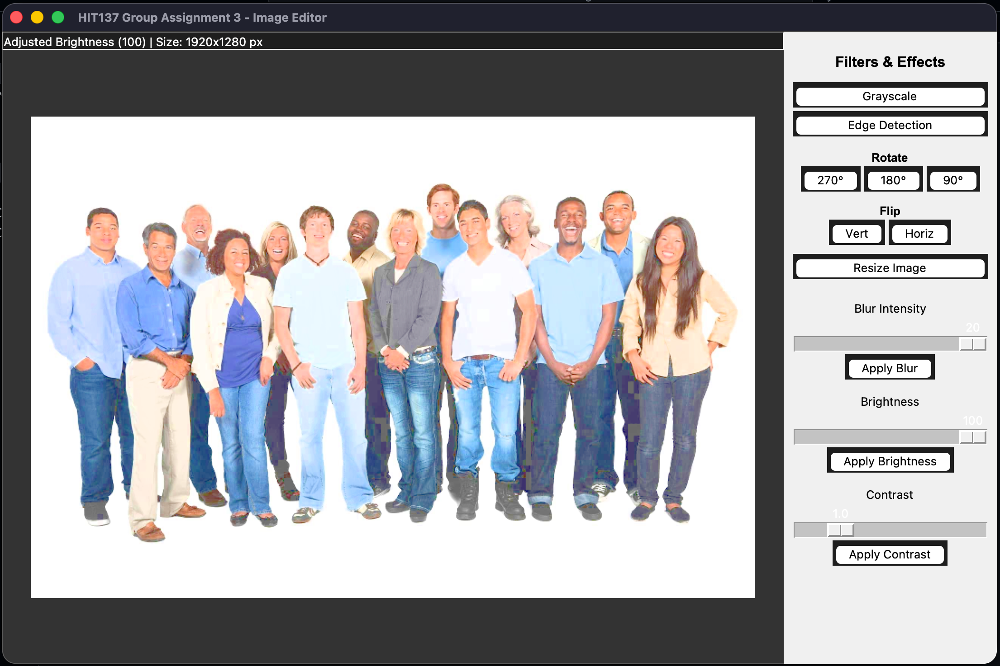
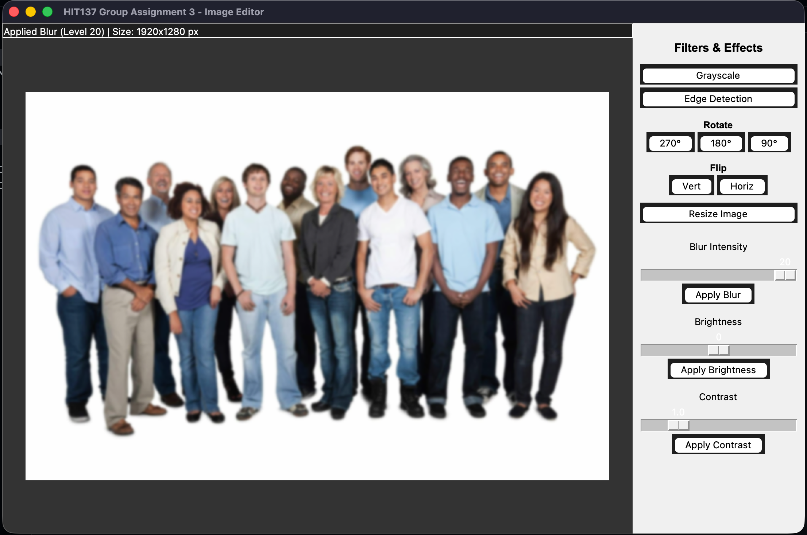
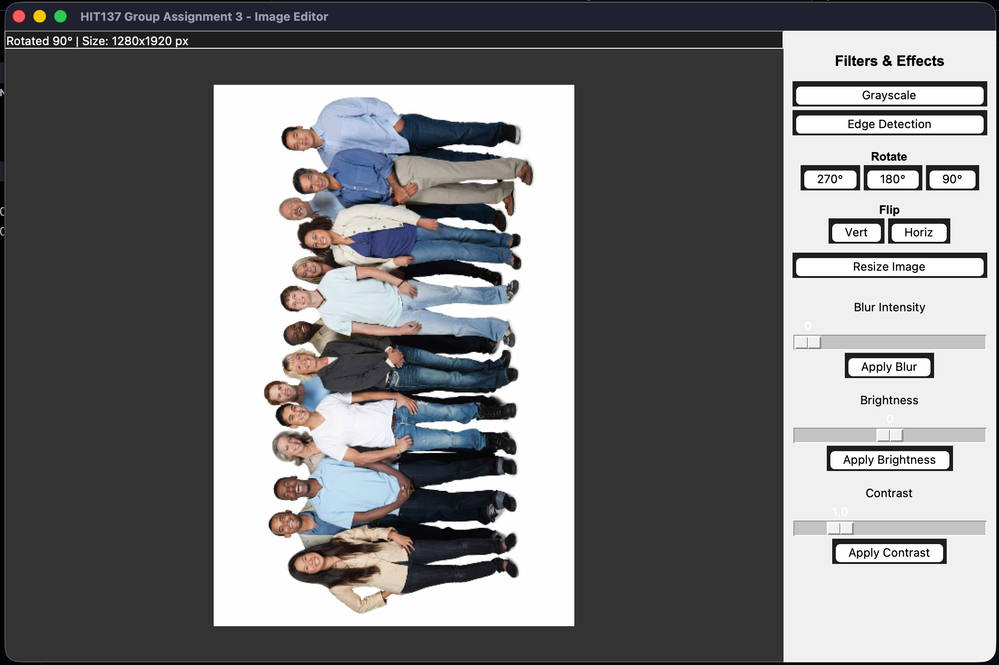

# HIT137 Assignment 3 - Image Editor

### Example Image
Below is the original input image used for demonstration:

### Grayscale Filter Output

### Edge Detection Output

### Flip Output

### Contrast Output

### Brightness Output

### Blur Effect Output

### Rotating Image Output

### Resize Output

